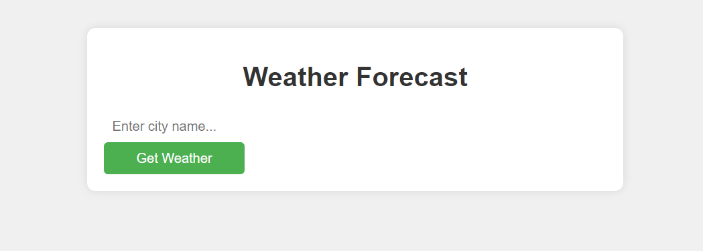
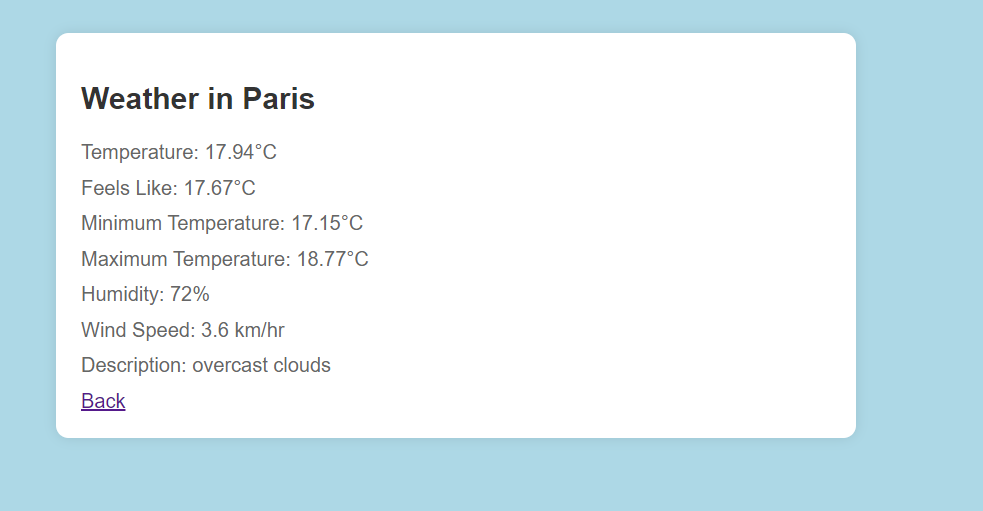

# Weather App

This Python application retrieves current weather data for a specified city using the OpenWeatherMap API and displays it in a basic web interface.

## Features

- Retrieves current temperature, feels like temperature, minimum and maximum temperatures, humidity, wind speed, and weather description for a specified city.
- Provides a clean web interface to display weather information.

## Prerequisites

Before running this application, make sure you have the following installed:

- Python 3.x
- requests library (install using `pip install requests`)

 Open a web browser and navigate to `http://localhost:8000` to access the application.

 Enter a city name in the input field and click "Get Weather" to view weather information for that city.

## Example

Here's a screenshot of how the application looks:





## API Key

## API Key

This application uses the OpenWeatherMap API to fetch weather data. You need to provide your API key in `weather_app.py` (replace `YOUR_API_KEY` with your actual API key).

```python
url = f'http://api.openweathermap.org/data/2.5/weather?q={city}&appid=YOUR_API_KEY&units=metric' 


